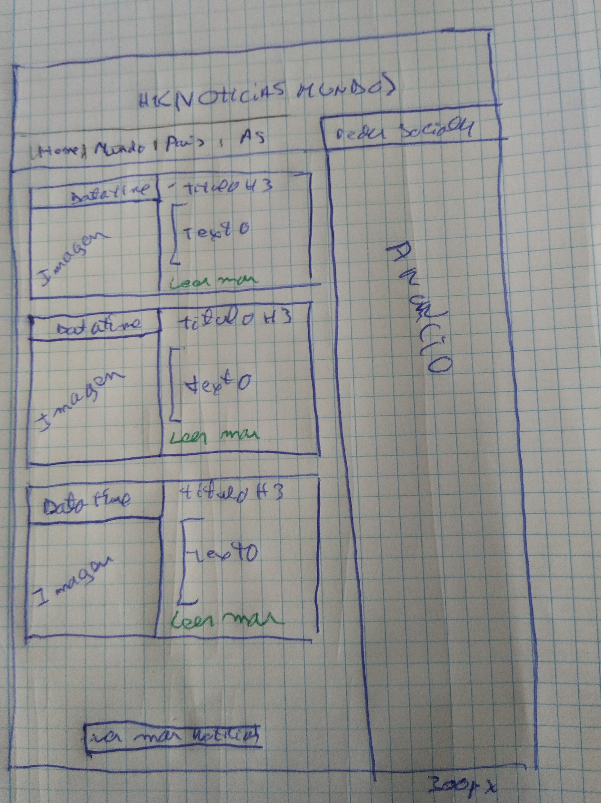

# Trabajo-final-LLMM

Projecte final: Pàgina web de notícies auto emplenable amb el scroll
Objectiu final: Realitzar una aplicació web de notícies que, en fer scroll fins abaix, recarregui més notícies amb html, , JSON, jQuery i Bootstrap.

## Abans de començar:

- Es recomana l'ús d'un quadern per fer un disseny i el seguiment del desenvolupament de l'aplicació. .

- Per disssenyar i programar primer ho feim al quadern, i quan ho tenim clar, es traduiex a l'ordinador.

## Especificacions del client:

### La maquetació (layer design) ha de deixar 300 px d'espai a la dreta de la pantalla per publicitat si la pantalla és suficientment -ample. Tot altre diseny és lliure.
### Per dispositius mòbils, la publicitat anirá fixada a la part inferior o bé només es mostrará a la part superior (i desapareixerà en fer scroll) amb un alt de 90px. Pots triar l'opció. Tot altre diseny és lliure.
### Les dades són: títol (entorn a 8 paraules), imgbig (url al json, imatge a la carpeta), imgmid (url al json, imatge a la carpeta), descripció (mínim de 300 caràcters), data i hora (datetime).
### Totes les notícies han de tenir el mateix format i mostrar les dades especificades de forma elegant a tot dispositiu.
Tasques:

- Realitza la maquetació del projecte. Entrega un breu document amb l'análisi i la planificació (molt important, aquesta planificació s'ha de cumplir) al README.md (valen fotos d'esquemes del quadern).
(fins a 1 punts).
- Presenta news.html amb 3 notícies (ja escrites al html, no carregar amb js) i emmagatzema 6 noticies més en dos fitxers, data/1.json data/2.json per ser carregades amb js.
(fins a 2 punts)
- Codifica news.js en jQuery per fer: "botó carregar més notícies" i "scroll bottom" que, en ser activat qualsevol d'ells, faci una càrrega i presentació de més dades (fins a dues vegades 1.json, 2.json)
(fins a 1 punt)
- Inclou rss.xml (especificat al següent tema)
(fins a 1 punt)
- Codifica news1.html i news2.html, pàgines que corresponen a les dues primeres noticies (darreres publicades). Quan feim clic a la notícia 1 de news.html ens va a news1.html, quan feim clic a la notícia 2 de news.html ens va a news2.html 
(fins a 1 punt)
- La plantilla o pàgina de veure una sola notícia news1.html (news2.html és idèntica) ha de contenir una imatge i un vídeo de youtube responsive. 
(fins a 1 punt)
- Cada pàgina ha de contenir les etiquetes meta (amb open graph) per compartir títol, descripció, imatge (gran), nom de l'aplicació i url de la pàgina. 
(fins a 1 punt)
### Fins a + 2 punts: acabat final (o dit d'un altra forma: complir les especificacions del client o donar solucions elegants alternatives).

### Esquema dinujado a cuaderno de como sera mi  HTML

# explicación del trabajo 

Este trabajo consta de 3 paginas (news.html, news1.html y news2.html) que son parte vital y necesaria del trabajo, así como de un archivo news.css dentro de la carpeta css, un news.js (javacript) dentro de la carpeta js, dos archivos (1.json y 2.json) dentro de la carpeta data y un noticias.rss dentro de la carpeta rss.

 La pagina principal del trabajo es news.html que es donde se encuentra las diferentes noticias resumidas y expuesta directamente, 3 en el html, las otras 6 se ponen en tandas de 3 según el formato que tu decidas. Mi pagina principal consta de 2 menús al mismo nivel, uno de links donde encontramos el home y otros links a otras paginas de noticias y otro de redes, donde encontramos las principales redes con sus iconos. Justo debajo de estos menús, he introducido un submenu que es  donde se puede activar y desactivar el scroll ( al cargar la pagina siempre esta desactivado), si se activa, el botón de cargar mas noticias desaparece y las noticias se van cargando automáticamente cada ves que llegamos al final de la pagina. A continuación, podemos encontrar la selección de noticias que esta compuesto inicialmente por 3 noticias, a su derecha y en un  espacio de 300px encontraremos el anunció (siempre y cuando la anchura de la pagina sea superior a 968px, en caso de anchura inferior esta publicidad desaparece y aparece abajo de todo de la pantalla en posición fija otra tipo de publicidad, se deja siempre un margen abajo del tamaño de la publicidad para que esta no impida en ningún momento visualizar cualquier otro elemento de la pagina). Para finalizar la pagina principal encontraremos en caso de de no haber activado el scroll un botón de “ver mas noticias antiguas” que podremos darle clic hasta 2 veces, después el botón cambia de “ver mas noticias antiguas” a “no hay más noticias”.

Cuando le damos clic la primera ves al botón “ver mas noticias” utilizamos el js que hace una lectura del 1.json que se encuentra en la carpeta data y lo introduce en el news.html al darle el segundo clic, lee 2.json y introduce la información de nuevo en el news.html (cada json dispone de 3 noticias que son introducidas).

En el news1 y news 2 encontraremos el mismo header que news.html pero sin el apartado de activar scroll.  Ahora pasamos a tener una única noticia con su imagen en tamaño adaptado a la pantalla así como un video de youtube también adaptado al tamaño de la pantalla y que podremos ver directamente desde la pagina, la publicidad de esta pagina es exactamente igual a la principal y funciona de manera idéntica. Al final de las paginas news1 y news2 encontraremos un botón de volver a la home si la pantalla es inferior a  968px con el objetivo de ahorrar al usuario tener que ir hasta el header para poder hacerlo.

Yo utilizo dos html mas que los dicho anteriormente, el primero adds.html lo utilizo para la publicidad que se muestra en la parte derecha de la pantalla siempre que esta tenga un tamaño superior a 968px, el addsM.html es la publicidad que se muestra fija en la parte inferior de la pantalla si esta es inferior a 968px. La función de los dos html es hacer ir cambiando las imágenes de publicidad que se muestran cada 5 segundos, adds.html, y addsM.html no tienen las misma publicidad (no utilizan las misma imágenes ni las mismas marcas) para así garantizar también una variación en esta misma.

Una de las peticiones del trabajo era utilizar las etiquetas meta, en mi caso estas etiquetas se utilizan en cada pagina (news.html, news1.html y news2.html) para facilitar compartir dichas paginas en Facebook.
